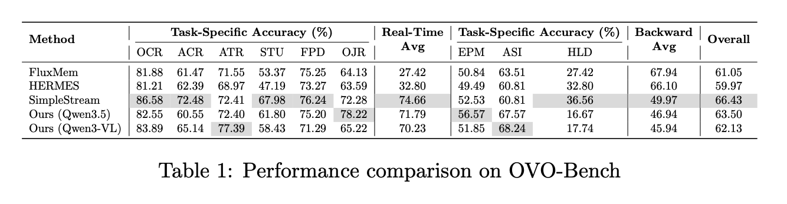

<h1 align="center" style="font-weight:600;">
  StreamTeller — PredictMem
</h1>

<h3 align="center">
  Streaming Visual Token Pruning for VLM Prefill via V-JEPA Prediction Loss
</h3>

> PredictMem uses a training-free V-JEPA prediction-loss scorer to identify and discard redundant visual tokens in streaming video, reducing LLM prefill latency and KV-cache memory for Qwen3.5 without any fine-tuning.



## Highlights

- **Prediction-loss gating.** V-JEPA predicts future frames; high prediction-loss patches are informative and kept, low-loss patches are redundant and dropped.
- **Training-free & plug-and-play.** Drops into Qwen3.5 as an in-model plugin — no model surgery, no fine-tuning required.
- **Streaming scoring.** Expanding + sliding window V-JEPA scoring with online t-digest threshold estimation adapts to video content without offline pre-computation.
- **Compact memory path.** Optional tubelet-by-tubelet streaming pipeline avoids materializing full visual embeddings, capping peak GPU memory even for very long videos.

## Repository Layout

```
StreamTeller
├── models/
│   ├── predictmem/              # PredictMem plugin (decoupled from Qwen)
│   │   ├── config.py            #   Configuration dataclass
│   │   ├── vjepa_scorer.py      #   V-JEPA encoder/predictor → per-patch loss
│   │   ├── streaming_memory.py  #   In-model scoring + pruning plugin
│   │   ├── token_pruner.py      #   Token-level mask → pruned embeddings
│   │   ├── streaming_sampler.py #   Tubelet-by-tubelet video sampling
│   │   ├── qwen_visual_chunk.py #   Per-chunk Qwen visual tower
│   │   ├── compact_memory.py    #   Streaming compact memory pipeline
│   │   ├── resize_utils.py      #   Aspect-preserving Qwen/JEPA resize
│   │   ├── vision_inputs.py     #   Video decode + ImageNet normalize
│   │   └── legacy/              #   Deprecated modules
│   └── qwen3_5/                 # Qwen3.5-9B (local implementation)
│       └── modeling_qwen3_5.py  #   PredictMem + compact memory integration
├── evaluate/                    # Evaluation framework
│   ├── common/                  #   Shared model/video/generation helpers
│   ├── ovobench/                #   OVO-Bench evaluation
│   └── streamingbench/          #   StreamingBench evaluation
├── scripts/                     # Visualization & analysis scripts
├── assets/                      # README figures
└── summary.md                   # Detailed project status & design notes
```

## Installation

```bash
# Requirements: PyTorch 2.x, CUDA 12.x
pip install transformers accelerate decord tdigest pillow

# V-JEPA dependencies
pip install -e site-packages/vjepa2

# Flash-Attention (recommended)
pip install flash-attn --no-build-isolation

# Model weights (set up paths)
#   Qwen3.5-9B:  /data/model_weights_public/Qwen/Qwen3.5-9B
#   V-JEPA:      /data/model_weights_public/jepa/jeap_vitl_16_256.pt
```

## Quick Start

```python
from evaluate.common.qwen35_predictmem import (
    load_qwen35_model,
    load_qwen35_processor,
    build_video_inputs_for_eval,
    generate_qwen35_response,
)

model = load_qwen35_model(
    "/data/model_weights_public/Qwen/Qwen3.5-9B",
    jepa_checkpoint_path="/data/model_weights_public/jepa/jeap_vitl_16_256.pt",
    vjepa_src_path="/root/stream/StreamTeller/site-packages/vjepa2",
    predictmem_keep_ratio=0.10,
    tail_keep_frames=4,
)
processor = load_qwen35_processor(
    "/data/model_weights_public/Qwen/Qwen3.5-9B", fps=1.0
)

qwen_frames, jepa_tensor, meta, _ = build_video_inputs_for_eval(
    "path/to/video.mp4", fps=1.0, frame_budget=0, stream_mode="full",
)

response, stats = generate_qwen35_response(
    model, processor, "Describe this video.",
    qwen_frames=qwen_frames,
    video_metadata=meta,
    method="predictmem",
    predictmem_runtime="plugin",
    predictmem_frames_256=jepa_tensor,
    predictmem_keep_ratio=0.10,
)
print(response)
print(f"Kept {stats['predictmem_stats']['kept_video_tokens']} / {stats['expected_video_tokens']} video tokens")
```

## Evaluation

### OVO-Bench

```bash
# Baseline — last 4 frames only
bash evaluate/ovobench/ovobench.sh \
  --method baseline --frame-budget 4 --stream-mode recent --num-gpus 2

# PredictMem plugin — full video, V-JEPA prunes to ~10%
bash evaluate/ovobench/ovobench.sh \
  --method predictmem --keep-ratio 0.10 --tail-keep-frames 4 --num-gpus 2

# PredictMem compact — streaming pipeline, capped memory
bash evaluate/ovobench/ovobench.sh \
  --method predictmem --keep-ratio 0.10 --num-gpus 2
```

### StreamingBench

```bash
bash evaluate/streamingbench/streamingbench.sh \
  --method predictmem \
  --task-csv /data/qinian_workspace/StreamingBench/StreamingBench/Real_Time_Visual_Understanding.csv \
  --video-dir /data/qinian_workspace/StreamingBench/data/real \
  --num-gpus 2
```

Key parameters:

| Parameter | Description | Default |
|---|---|---|
| `--method` | `baseline` or `predictmem` | `predictmem` |
| `--keep-ratio` | Fraction of middle-tubelet tokens kept | `0.10` |
| `--tail-keep-frames` | Last N frames always fully kept | `4` |
| `--frame-budget` | Max frames to decode (0 = all) | `0` |
| `--stream-mode` | `full` = all frames, `recent` = last N | `full` |
| `--fps` | Sampling frame rate | `1.0` |

## License

Apache-2.0. Please also follow upstream model (Qwen3.5-VL) and dataset licenses.

## Acknowledgements

Built on [V-JEPA](https://github.com/facebookresearch/jepa), [Qwen3.5-VL](https://github.com/QwenLM/Qwen3-VL), [OVO-Bench](https://github.com/JoeLeelyf/OVO-Bench), [StreamingBench](https://github.com/Infini-AI-Lab/StreamingBench), and [FluxMem](https://github.com/YiwengXie/FluxMem).
